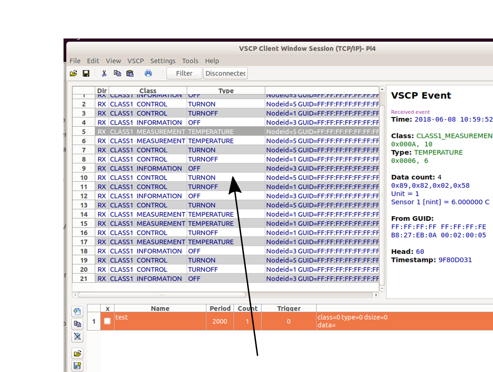
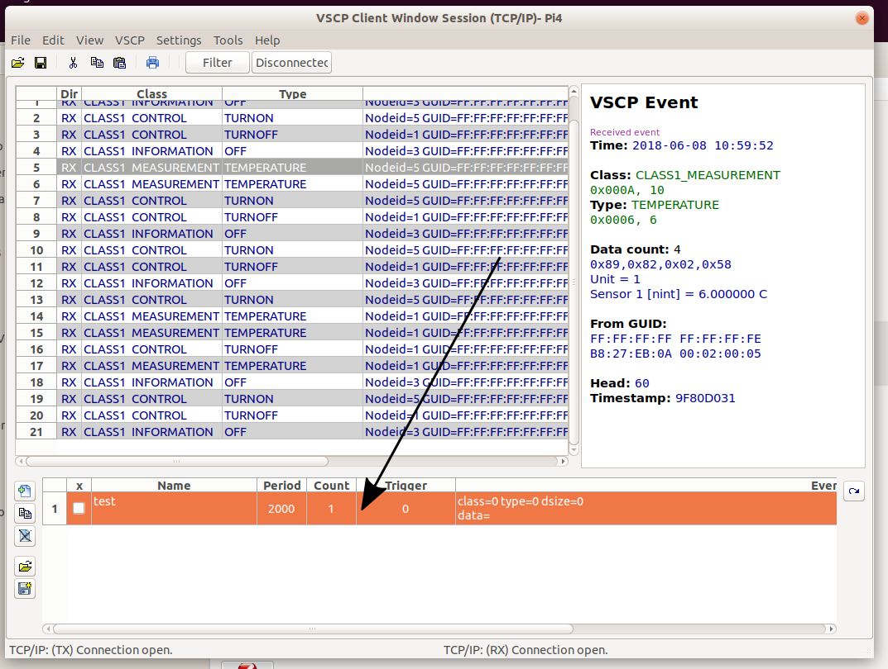
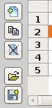
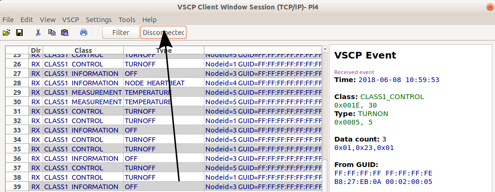

# The Client session window

With the client window of VSCP works it is possible to open communication sessions that either connect

* Directly to a Level I (CANAL) hardware driver. Depending on the driver, one or more sessions can be opened to the driver. The normal is however one.
* Open a session to a local or remote VSCP node or daemon which in turn have drivers connected to it. The node should export the [VSCP tcp/ip link protocol](http://docs.vscp.org/spec/latest/#/./vscp_over_tcp_ip).

To open a new session windoow use the File/New VSCP Client window. You can now select a predefined interface to connect to or create a new.

Below is a picture of how this window looks on Ubuntu Linux

Remote item interfaces have **“TCP/IP:”** in front of them and local interface items or direct connection items to Level I (CANAL) drivers have **“CANAL:”** in front of them. 

The first type always listed is the **“Unconnected Mode”** wich opens the window without a connection either to a remote server or a Level I (CANAL) driver. This is useful when one wants to investigate saved session data.

* With the **Add** button a new TCP/IP or Level I (CANAL) interface can be added. 
* With the **Edit** button an already available interface setting can be edited/changed.
* With the **Remove** button an already available interface can be removed.

The image below shows how the Level I (CANAL) session edit window looks like on Ubunto Linux

Standard Level I (CANAL) interface settings is available here.

* **Description** - Set a descriptive name here for use in listboxes etc.
* **Path to Driver** - The box to the right allows location to be found on the system.
* **Device configuration string** - The string used to configure the driver.
* **Flags** - The numerical flag value used to configure the driver.

A Level I (CANAL) driver can have an internal XML file stored that describes the configuration string. If the driver has such information the button to the right of the configuration string can be used to run a wizard that helps in setting up both the flags field and the configuration field in an easy way without needing to find the drivers full documentation.

The image below shows how the remote TCP/IP server edit window looks like on Ubuntu Linux

The remote TCP/IP interface needs the following parameters to be defined and set

* **Description** - Set a descriptive name here for use in listboxes etc.
* **Server URL** - The hostname for the remote VSCP tcp/ip node.
* **Server port** - The port that the remote VSCP tcp/ip node is listening on. Normaly 9598.
* **Username** - Username used to login to the remote node.
* **Password** - Password used to login to the remote node. Leave blank to force VSCP Works to ask before connecting.
* **GUID** - This is the globally unique id (GUID) for the rmote interface and it should normally be set to all zero for a standard remote connection. In this case a sent event from our client will be sent on all aailable interfaces on the remote node. If a valid interface GUID is entered here (a GUID for the remote nodes interface) all sent events will only go to devices on the selected interface. As a help to set the correct interface the **Get Interface** button is available which will fetch all available interfaces from the remote node and allow you to slect one of them.

Use the **Set Filter** button to set an incoming filter fpr this session. Only events that satisfy the filter/mask combination will be received from the remote node.

Use the **Test Connection** button to test the connection to the remote node.

----

Selecting one of the interfaces and pressing OK (or double clicking the line) opens the session window

Ubuntu Linux session window

The session window is divided into three main areas. The upper left area is the **receive list**, the upper right area (when a row is selected in the receive list) is the **information area** and the lower area is the **transmission list**. 

### Receive List
Events that are received from a remote node is listed in the receive list (Marked with **RX**) but also transmitted events are showed here (marked with **TX*). 

Currently a chronological view is available (message log). Other views may follow in the future.

By right clicking on the receive list some functionality will be available

* **Clear all receive events** which lets you removve all events in the receive session window. The command is alos available under the **Edit** menu.
* **Load VSCP events from file** which lets you load saved events from disk to the receive session window. You will get a question asking if you want to remove all events currently in the receive session window brefore the new events is loaded from disk. The command is also available under the **File** menu.
* **Save VSCP events to file** which lets you save (selected or all) VSCP events to a file on disk. The command is also available under the **File** menu. On Linux systems you may need to select the pen icon in the upper left top of the save file window to write a filename (see below).

In the menus you can 

* Edit the selected row.
* Add a note for the selected row.
* Copy/Cut/paste rows.
* Transmit one or many selected rows.
* Edit and transmit one or many selected rows.
* Save selected row(s) as transmission objects.
* Load VSCP events from file.
* Save VSCP events from file.

#### Filter received events
Sometimes the inflow of received events can be very large and at the same time you are only interested in some specific events. In this case you can set a receive filter.

Receive filters can be set in two ways

* You can decide which events that should be received.
* You can decide which events that should not be received.

Well you can actually do both at the same time.

The first thing you have to do to use receive event filtering is to define a filter. You do this under the menu

    /Settings/Set filter...

which will bring up this dialog window.

Here you can define the events the filter should consist off.

* Use **Add display event...* to add events that you want to be displayed. That is an event listed here that is received will be listed in the receive list.
* Use **Add filter event...** to add events that you don't want to be displayed. An event lsted here that is received will not be listed in the receive list.

You can allow a full class of events to be received by adding it with type "general" to the *add display event...*. This is tru also for the filter.

**Warning!** You can end up getting nothing in the receive list if you add contaradictory settings in the two list boxes.

You can load save display/filter lists to a file on disk. Select the appropriate box before load/save. To clearify

* If **display** is selected and you press **save**, the content in the display list will be saved to disk.
* If **filter** is selected and you press **save**, the content in the filter list will be saved to disk.
* If **display** is selected and you press **load**, the content in the display list will be loaded with the content of the selected file on disk.
* If **filter** is selected and you press **save**, the content in the filter list will be loaded with the content of the selected file on disk.

**Enable** enables (selected) or disables the set filter. There is also a button in the receive windows that does the same thing

When in it's in-position the filter is active else it is inactive.

### Transmission area

In the transmission area list rows are available that can be transmitted to the connected remote node or driver. It is possible to load and save transmission row sets which can be handy in many situations. It is possible to creat rows that is automatically transmitted with a selected period expressed in milliseconds and which continue to do so as long as they are active. It is also possible to create transmission row objects that automatically send out one or more event when another event is received.

On the right of the Transmission object list is a set of buttons

that have functionality that control rows in the list. You can reach this functionality also by tight clicking on a row.

* The top button **add a new transmission row**. 
* The second button **edit a selected row item**- 
* The third button **delete a selected row item**.

- The forth button **load transmission item rows** from a file on disk.
- The fifth button **save the current (selected) rows** to a file on disk.

On the right is a single button

This button is used to transmit the events of the selected row(s). A single row can also be sent by double clicking on it. 

Additional functionality is available by right clicking in the transmission object list.

* Transmit selected row(s).
* Add/edit/Delete rows.
* Clone row.
* Enable/disable periodic transmission.

The transmission row edit window looks like this on Ubuntu Linux

Standard settings for events are available here. To use the GUID assigned by the daemon as the originator for the event leave the GUID set to all zeros.

* Set a name for the transmission item for reference.

* Select the class and the type.
 
* Select the priority. "Normal" is usually a good choice.

* Set the data for the event. This is just a comma separated list of hexadecimal or decimal values (mixed if needed). Hexadecimal value is entered with **0x** in front of them.

* Count is the number of events too send when the transmission row is triggered.

* Period is the time in milliseconds between automatically transmitted events.

* Trigger is a selected trigger among the available triggers.

When done click OK to save you settings and you get a new transmission row added to the transmisison area.

### Information area

Information about a selected event in the receive list is shown in the information area.

Here you get information on 

* When the veent is received.
* Class/type information.
* Raw data.
* For most events decoded data.
* Sender GUID.
* Head code
* Timestamp.

The event here is [CLASS1_MEASUREMENT. Type=6,Temperature](http://docs.vscp.org/spec/latest/#/./class1.measurement?id=type6-0x06-temperature)

You see that in the measurement example aboove that the temperature is expressed in the unit it was sent in (degrees Celsius). The measure event is decoded and you see the unit and the data type (normalized integer (nint)  used to code the measurement value in this case. You also see the measurement originate from sensor 1 of the remote device.

A [CLASS1_INFORMATION. Type=5,Turn-on](http://docs.vscp.org/spec/latest/#/./class1.information?id=type3-0x03-on) event looks like this

You can load events from disk and investigate them at a later time if you like.

### The session connect/disconnect button

You can use the session connect/disconnect button to connect or disconnect the remote node. This may be useful if you have a lot of events coming in and you want to stop and investigate them. Just temporarily disconnect the session and do your investigation and connect again when you are ready. No need to close the session window.

### Multiple session windows
You can (almost) always have multiple session windows open at the same time too the same remote device if you connect over tcp/ip. This for example makes it possible to have session windows with different filters open at the same time. The exception is when you connect to a remote node that only accept one connection at a time. Usually resource limited devices.

For a Level I (CANAL) connection this depends on the driver. Most driver just accept one connection. Some accept several. Check the documentation for the driver to find out.

[filename](./bottom_copyright.md ':include')