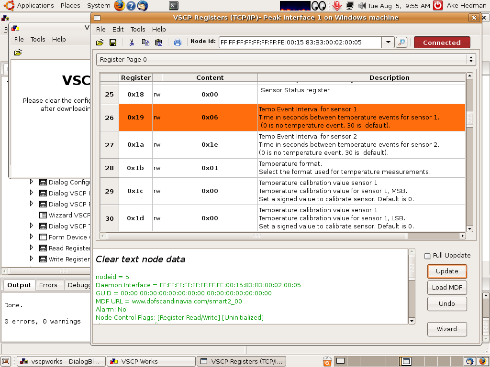
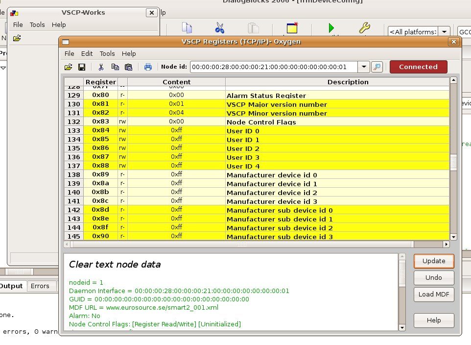
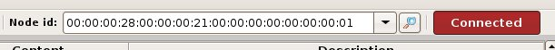

# Device configuration window

The node configuration window can be used to set parameters for a remote node. It's main use is for developers as it will not display a remote nodes content in the most user friendly way. Still it can be useful also for (at least anvanced) users when editing and investigating registers on remote nodes. 

In the window you can

* **Handling register** values on all pages of the remote device inluding standard registers.
* Read/write values from/to a node through it's defined **abstractions**. Abstraction is a way for a remote node to present it's settings and other variables in a high level way.
* Read and program a remote nodes **decision matrix** if it has one.
* Investigate and run **wizards** defined for the remote node. Wizards are setup and configuration sequence's node defines for it's own setup that walk a user through the setup steps in a user friendly way.

On Ubuntu Linux this window looks like this

In the above screenshot we have highlighted the registry entry that set the interval for temperature reports on the [CAN4VSCP Kelvin module](http://www.grodansparadis.com/kelvinntc10k/kelvin_ntc10ka.html). To change it one just click on the value and select update. The operations are the same if the module is locally connected or located on the other side of the earth.

## Registers

When a configuration window is opened a remote node must be selected just as for the communication session window. Also here it is possible to connect through a local Level I (CANAL) driver or to a remote tcp/ip connected node. The only difference between the two is that you need to enter a valid nickname id for a Level I (CANAL) session before clicking update and that this id must be a full interface id with the least significant byte set to the nickname id fore a remote interface.

A click on the update button loads all registers from the remote node, both custom and standard registers. A clear text field is available at the bottom of the screen where data from teh standard registers is presented in a more human readable form. For instance the MDF URL is in clear text etc.

The first time the update button is clicked the MDF for the remote node will be loaded and then all registers (custom and standard) will be read. It is possible to load the MDF and read all registers every time update is clicked by selecting the **full updates** box. This will however lengthen the update procedure considerably.

 The load process parse the MDF and use the correct descriptions for all custom registers of a remote node. Furthermore abstractions can be used (if defined) allowing for entering configuration values in a more human friendly way than mere register editing allow for.

When registers are edited there new content can be written back to the remote node with a new update click or by right clicking on the register. Update will write all changed registers back to the node and verify they are written correctly to each register.

The **undo** button can be used to reset all register to the content they had when the register session was opened.

If you have a node under development that does not already have a MDF distributed you can load it manually. In the clear register mode (without a MDF loaded) VSCP Works only fully recognize standard registers. It is also impossible for it to differentiate between read-only and read/write registers in custom register space. The Load MDF button loads an MDF from disk. Useful also whn you are building the MDF file to verify it is describing what it should describe.

The nodeid field looks different when connected to a remote node or to a local Level I (CANAL) driver. For a remote node the interface GUID is part of the id for the node and it tells which interface to talk to on the remote node. The least significant byte(s) (16-bit but often just 8-bits are used) of this GUID is the node id for the device connected to that interface. For a session connected directly to a Level I (CANAL) device only the node-id is entered here.

To the right of the node-id field is a ***search button**. It can be used to check that a node with the entered node-id really is present.

The connected/disconnected button tell if the connection to the server is active or not and can also be used to disconnect/reconnect the connection.

### Register row right click options

When you right click on a register row you get the following options

* **Read value(s)** for selected row(s). - Read the selected register content. Can be useful when registers contains measurements or other values that dynamically change.
* **Write value(s)** for selected row(s). - Write the values of the selected registers to the remote node. The written value is validated.
* **Undo value(s)** for selected row(s). - Undo the changed values for the selected rows.
* **Write default(s)** for selected row(s). - Set default values for selected rows and write them to the remote node.
* **Goto register page...** - Got to a specific rregister page. The firts ten register pages can be reached from menu's (Navigate) or with short commands **ctrl+0** -- **ctrl+9**

## Abstractions

## Decision Matrix

## Wizards

[filename](./bottom_copyright.md ':include')