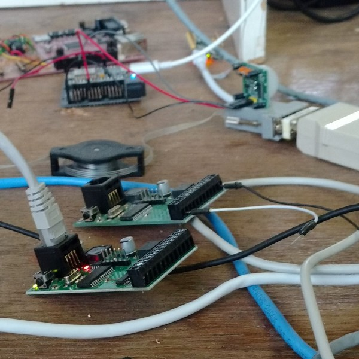
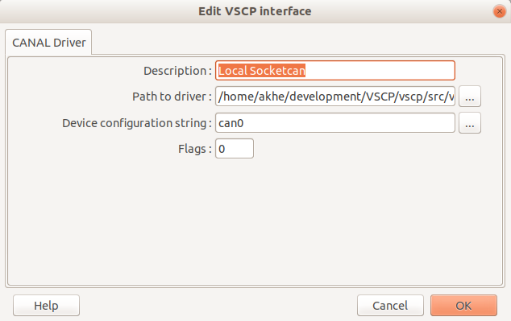
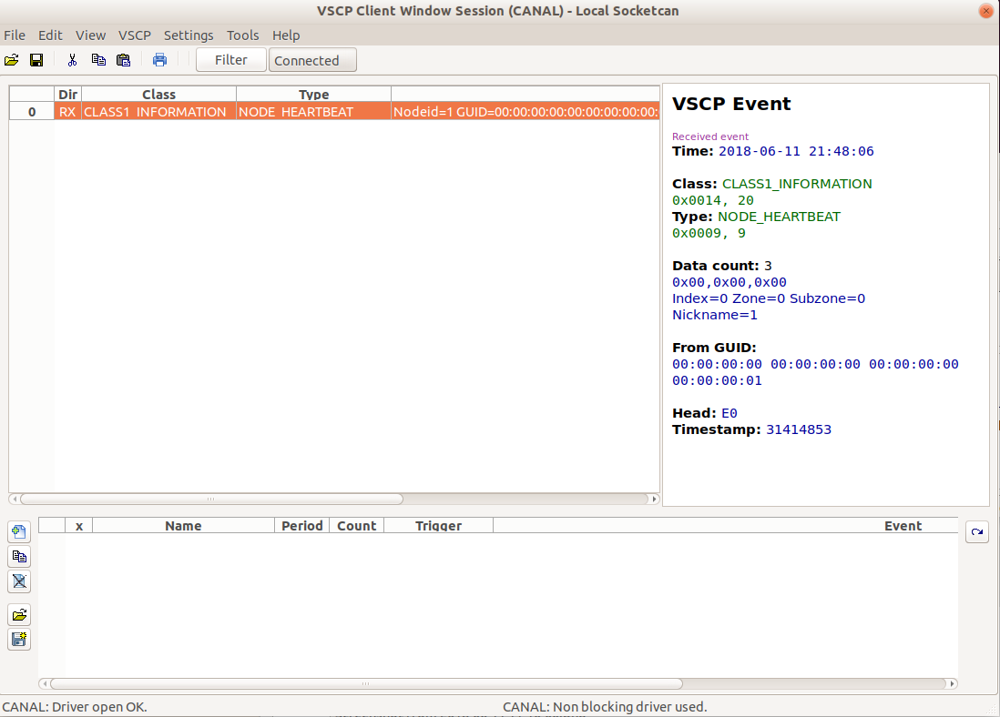
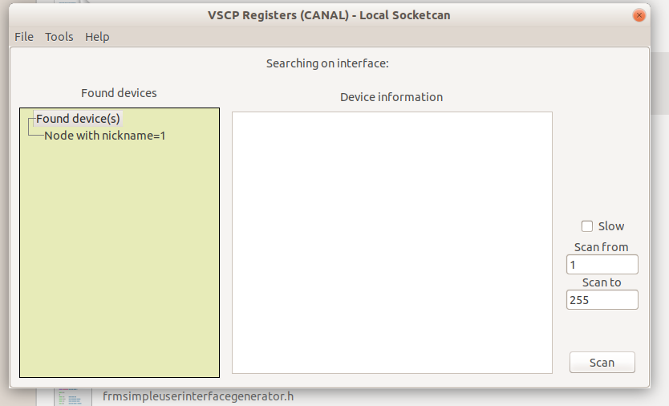
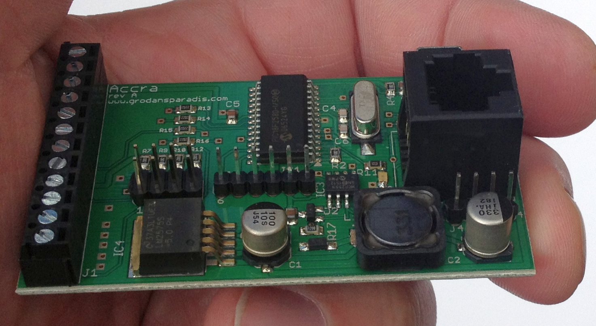
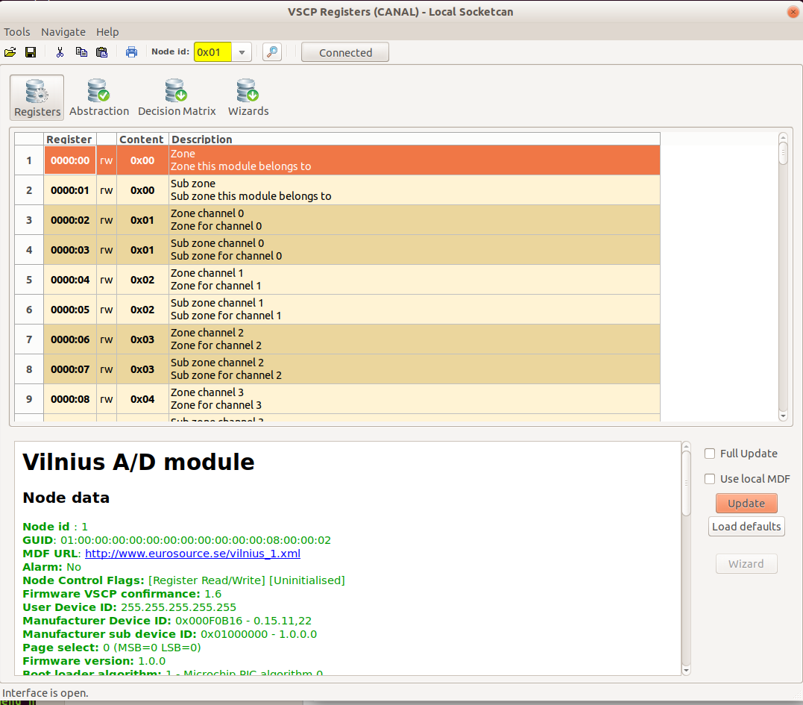
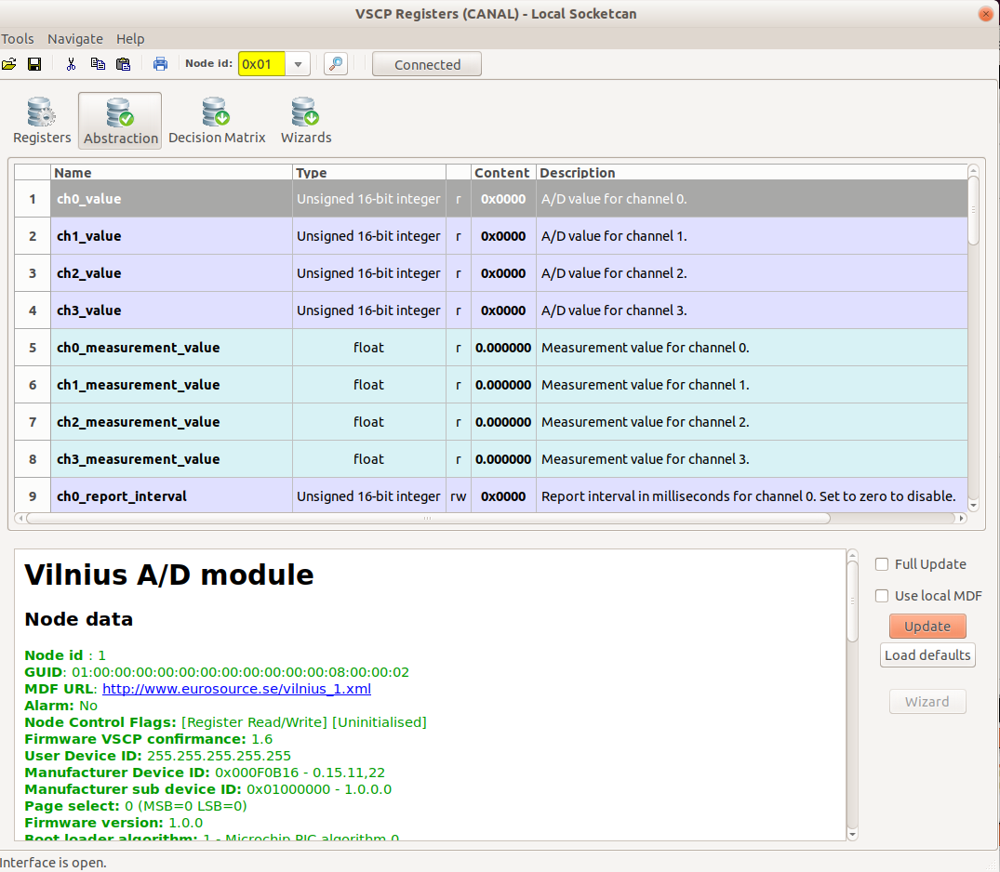
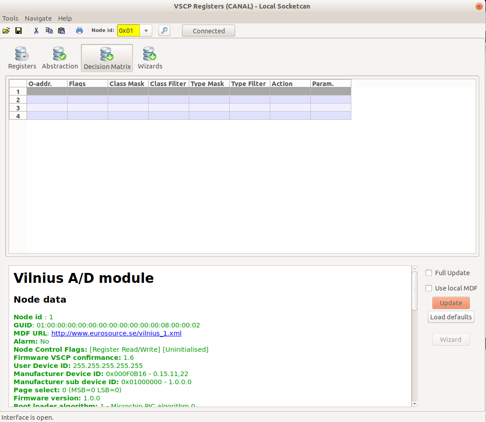
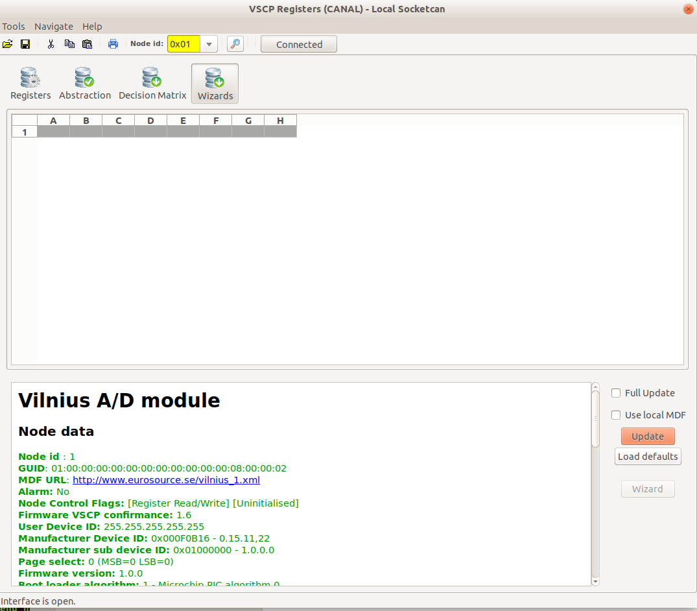

# Investigate a new device

You get that device on your desk, like the one in the picture above. You hook it up. An then? Usually you need to dig up info in manuals trying to understand how to work with the device. Every device is different. Even hooking it up can be a big deal. There is many ways to do so. If it needs power you must at least know what voltage is needed and where to connect it.

VSCP relax much of this. Lets have a look at a piece of hardware. In this case it is a [CAN4VSCP device](https://grodansparadis.gitbooks.io/the-vscp-specification/vscp_over_can_can4vscp.html) but it could be a wireless device, an Ethernet connected device or a Bluetooth mesh device. 

## The interface abstraction
VSCP abstracts the physical connection to a device with one of two interfaces called Level I and Leve II. Both telling how higher level software systems talk to a low end device. what the device is and how it works is not important here. It does not even have too be a physical "thing". The interface abstraction layer only specify that on the other side of the interface is a device of some sort and that ee can talk to this device as it was a VSCP device. But it can just act as one, it does not have to be one. Every existing devices can be hooked up in this way. **ALL!**

## Discovery
You buy a device, you hook it up, VSCP will discovery it through it's heartbeat mechanism. This heartbeat looks different on different transport mediums. It can be a beacon signal on a Bluetooth device, a multicast datagram on wifi and Ethernet, etc. For CAN4VSCP it is a just a heartbeat message. **"Messages"** however is called **"events"** in VSCP. 

If you are intrested the standard VSCP heartbeat the **event** used is [CLASS1.INFORMATION, Type=9, Node Heartbeat](https://grodansparadis.gitbooks.io/the-vscp-specification/class1.information.html#type9)

On the VSCP Works tool the VSCP session window open up a communication channel through a Level I or Level II interface. This can be a connection to a single device or to a bus with many devices. It can also be a connection to the [VSCP Daemon](https://grodansparadis.gitbooks.io/the-vscp-daemon) which is an **IoT edge server** with a vast range of capabilities.

Here ee will only look at how this works for CANBUS as the transport mechanism. The functionality is much the same for raw Ethernet, TCP/IP, Bluetooth, WIFI etc, even simpler in many cases.

### CAN4VSCP discovery

For a CAN4VSCP node we can use any CANBUS adapter to connect a bus with such devices to a computer. On Linux we can use [SocketCAN](https://www.google.com/url?sa=t&rct=j&q=&esrc=s&source=web&cd=1&cad=rja&uact=8&ved=0ahUKEwjWnoLb5MvbAhVoyKYKHVcGBzcQFggoMAA&url=https%3A%2F%2Fen.wikipedia.org%2Fwiki%2FSocketCAN&usg=AOvVaw1wC_MpUCU_F_3fvkDWpN4A) which have drivers for most physical CANBUS interfaces already in the Kernel.

On Windows you directly use the VSCP driver available for the adapter. There is a driver available for most common CANBUS interfaces.

We add the [Level I socketCAN driver](https://grodansparadis.gitbooks.io/the-vscp-daemon/level1_driver_socketcan.html) SocketCAN to VSCP Works.

It is basically a name, the path to the driver and which SocketCAN interface to use (*can0*). You can create virtual SocketCAN devices if you want.

If we now open a VSCP Works session window and let it stay open for a while we will see heartbeat evenst coming in from connected nodes.

Selecting the heart beat we see in the right window that this is a heartbeat from a device that have a nickname set to 1. Nickname id's are short id's used as device identifiers instead of [GUID's](https://grodansparadis.gitbooks.io/the-vscp-specification/vscp_globally_unique_identifiers.html) (16-byte) when the transport mechanism is unable to handle the full GUID. So now we know there is a node och the bus. But what device?

### Scanning for nodes
Instead of waiting for heartbeats from nodes one can actively search for the nodes. We do this in VSCP Works **scan for devices** window by selecting the interface we want to do the scan on and then hit scan.

In our example we again see one node with nickname equal to 1 after the scan. 

If we right click om the discovered node we get two choices

* Update node info from MDF.
* Open configuration window...

selecting the first entry fill in some info.

We get plenty of information about the device here. We see that this is an A/D conversion module. We also get the URL to the module. We can open it and get all information about the module.

[https://www.grodansparadis.com/vilnius/vilnius.html](https://www.grodansparadis.com/vilnius/vilnius.html)

This page contains information for human user. 

More interesting is another item, the path to the [MDF (Module Description File)](https://grodansparadis.gitbooks.io/the-vscp-specification/vscp_module_description_file.html). The MDF is an XML file that can describe any VSCP piece of hardware (or simulated hardware (and by tht any hardware) ) and which is readable by a machine. The node itself just holds the URL to the MDF, in this case

[http://www.grodansparadis.com/vilnius/vilnius.html](http://www.grodansparadis.com/vilnius/vilnius.html)

If we open this file in a browser we get plenty of information about the hardware device

If we scroll down we see

Here we can get a picture of the hardware (even severall).

[https://www.grodansparadis.com/accra/images/accra14.png](http://www.grodansparadis.com/accra/images/accra14.png)

We can get the **path to the latest firmware**. Perfect for some software that can update it on the remote device, you can get the path to the manual for the device, the email to support and the makers homepage and a lot of other things.

After the general info in the MDF, register definitions, abstractions, boot loader info, wizards and a lot of strange things appear in the file. Nothing of this is intended for humans. In fact all of the MDF is created for computers to read.

### Simpler way

There is a simpler way to look at the MDF content and investigate a device. We can let VSCP Works scan it for us by going to the configuration window, that is the second alternative from above.

This is how the Vilnius A/D converter device look in the configuration window

This window let us view and change configuration information and real time information such as measurements from the node. The default view is to look at the registers of the node (see [Register Abstraction Model](https://grodansparadis.gitbooks.io/the-vscp-specification/vscp_register_abstraction_model.html) if you want to read more).

There are som different views on the page

### Register Abstraction

All configuration and other information on a VSCP node is presented to the world as information in 8-bit registers. This means that to get data from a VSCP node or write data to a VSCP node only by using two simple low level operations.

* Read a register.
* Write a register.

Easy to implement in all systems, low level and high level. Not always so convenient for humans to use though. We are more used to stings, floats, int's and other higher level types.

### Abstractions

Abstractions are put above registers and is a way tp present register content of a node in a more higher level and more humn friendly way using strings,floating point integers etc.

### Decision Matrix

Next is the [decision matrix](https://grodansparadis.gitbooks.io/the-vscp-specification/vscp_decision_matrix.html). Not all devices have one but when it is there it is a standard way to configure dynamic behaviour of a hardware device.

### Wizards

Vilnius has no wizards defined so this item is empty here. But wizards is predefined configuration steps that can lead a user step by step in (maybe complicated) configurations of some specific functionality. The MDF file can hold many such step by step instruction sequence's. 

The wizard sequence actually just set abstractions and registers of the remote node but hide it all behind a descriptiv language o dialogs and options that maks it easy to write JavaScript and other code that present and handle input to/from a user.

## Conclusions
If you look into the [manual of the Vilnius A/D module](http://www.grodansparadis.com/vilnius/vilnius.html) you can read about it's functionality. The [registers](http://www.grodansparadis.com/vilnius/manual/doku.php?id=registers) show how the register of the device is defined. Ath [abstractions](http://www.grodansparadis.com/vilnius/manual/doku.php?id=abstractions) show how registers are presented on a higher level. The [decision matrix](http://www.grodansparadis.com/vilnius/manual/doku.php?id=decisionmatrix) makes it possible to control som I/O on the module when events arrive. Programmed autonomous and server less systems can be created coupling modules together.

The Vilnius A/D module is a CAN4VSCP device using the CANBUS to transport events. If could equally well have been a raw Ethernet device instead. Using Ethernet frames instead of CAN frames for transport. Or it could have been using UDP or Multicast or even be a TCP/IP device. The difference i sthe transport mechanism and how to connect to it.  

One of the most interesting aspect's is that the actual device does not have to be intelligent or a VSCP aware device at all. In this case the Level I or Level II driver is programed make it look like a VSCP device. The end result is amazing in that for a programmer and for software the interface to "control things" and "get information from things" is the same. A Zigbee, a Z-Wave, a 1-wire, and anything else can be controlled and presented in a common way. Also the devices using different techniques and coming from different manufacturers can be replaced by each other. **No lock down to a single manufacturer or a single technique anymore.**

[filename](./bottom_copyright.md ':include')